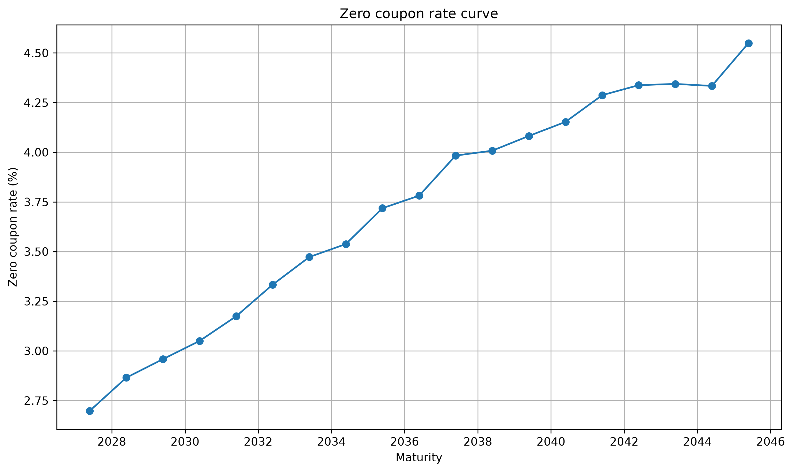
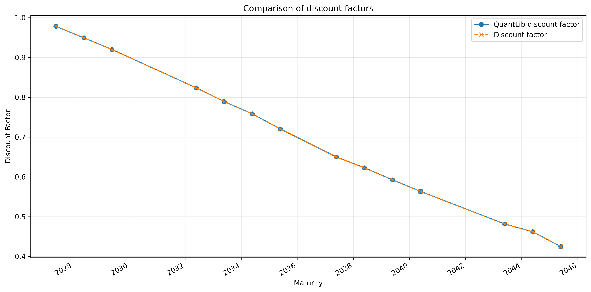
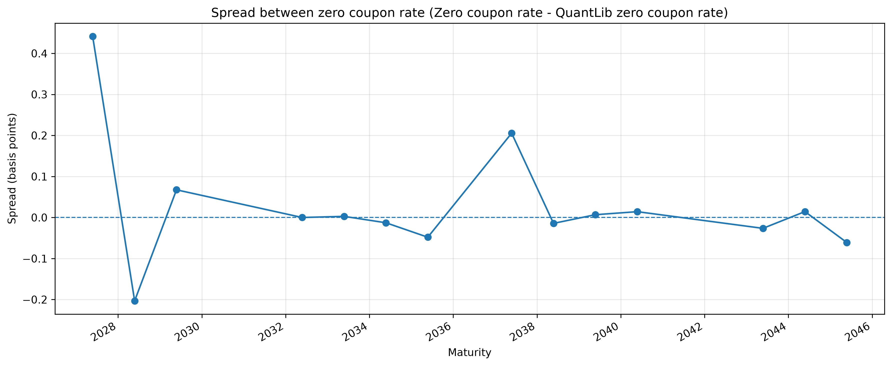

# Zero-Coupon Yield Curve Bootstrap

## Overview

	This project implements a zero-coupon yield curve bootstrap using French government bonds (OATs).
	It was developed as a personal summer project to explore interest-rate modelling and better understand the construction of discount and zero-coupon curves, alongside the study of Options, Futures, and Other Derivatives by John Hull.

## Objectives

	The main objectives of this project are to:

	- understand the mechanics of yield curve bootstrapping;
	- derive discount factors and zero-coupon rates from government bonds;
	- implement the methodology from scratch;
	- explore the impact of market conventions in bond pricing and yield curve construction;
	- gain practical experience with Pandas for financial data processing and analysis;
	- use QuantLib to price and bootstrap bonds, and compare its results with the from-scratch implementation.

## Methodology

### Valuation and Settlement

    The instruments studied are French government bonds (OATs), which pay fixed annual coupons and repay their nominal value at maturity.
    All valuations are performed as of 2026-07-29, using the clean closing prices observed on Euronext on that date.
    OAT transactions on Euronext follow the European T+2 settlement convention. The settlement date is therefore defined as two business days after the valuation date:

            Settlement Date = Valuation Date + 2 business days

    The settlement date serves as the reference date for both accrued coupon interest and future cash-flow calculations.

### Bootstrap Methodology

	The bootstrap is performed in four main steps :
		
		1. Calculate the cash flows associated with each bond.

		2. Calculate dirty prices from the clean prices provided in the dataset.

		3. Bootstrap discount factors using:

			Dirty Price = Σ Cash Flow(t) × Discount Factor(t)

		4. Derive zero-coupon rates from the resulting discount factors.

    

    The overall valuation and bootstrap process can be summarized as follows:

    

    

	                 Euronext Clean Price
                         │
                         ▼
                 Evaluation Date (T)
                         │
                         │ + 2 business days
                         ▼
                  Settlement Date
                         │
              ┌──────────┴──────────┐
              │                     │
              ▼                     ▼
       Accrued Interest       Future Cash Flows
       up to Settlement       after Settlement
              │                     │
              └──────────┬──────────┘
                         ▼
                    Dirty Price
                         │
                         ▼
                 Sequential Bootstrap
                         │
                         ▼
                Discount Factors
                         │
                         ▼
               Zero-Coupon Rates

               

	The bootstrap methodology is implemented from scratch.

	At each maturity, the discount factor corresponding to the current maturity is obtained by subtracting the present value of previously bootstrapped cash flows from the dirty price and dividing by the remaining cash flow:

      DF(t_n) = [Dirty Price - Σ Cash Flow(t_i) × DF(t_i)] / Cash Flow(t_n)

	Only previously bootstrapped discount factors are used. Therefore, the from-scratch bootstrap is performed sequentially without interpolation.
	The bonds are ordered by successive maturity dates, from the shortest maturity to the longest. 
	Each bond therefore contributes to the bootstrap only after the discount factors associated with earlier maturities have been determined. 
	This sequential maturity structure is essential to the from-scratch bootstrap and avoids relying on future zero rates or interpolation.

### QuantLib Benchmark

    QuantLib is only used for date handling and to implement an independent bootstrap benchmark.
    The QuantLib curve is constructed using `PiecewiseLogLinearDiscount`, providing a LogLinear interpolation between bootstrapped discount factors.
    This provides a useful intermediate approach between the sequential from-scratch bootstrap and a fully interpolated curve, allowing the two implementations to be compared and their differences analysed.

### Zero-Coupon Rates

	Zero-coupon rates are calculated using continuous compounding in both implementations. 
    In the from-scratch bootstrap, the compounding convention can be changed through the compounding argument, allowing annual compounding to be used if desired.

## Implementation

	The project is organized into separate folders for data, scripts, and results:

		ZCrates/
		├── data/
		│   ├── raw/          # Raw input data
		│   └── processed/    # Processed data
		├── results/
		│   └── quantlib/     # QuantLib results
		├── scripts/
		│   └── quantlib/     # QuantLib scripts
		├── main.py           # Main entry point
		├── README.md        # Project documentation
		└── requirements.txt  # Python dependencies

	The `data` folder stores the input and processed datasets.
	The `scripts` folder contains the calculation and processing scripts, including those based on QuantLib.
	The `results` folder stores the outputs generated by the different calculations.
	`main.py` is the main entry point used to run the project.

## Results

	The project produces the following main outputs:

		- Zero-coupon yield curve
		- Discount factor curves
		- Comparison between the results obtained from the bootstrap and QuantLib
		-CSV files containing the intermediate and final results

	The processed data in 'data/processed' includes:

		- cashflow
		- dirty_price
		- discount_factor

	The resulting zero-coupon rates are stored in 'results/', while the QuantLib results are stored in 'results/quantlib/'.

### Bootstrap Comparison

    The from-scratch bootstrap produces results that are very close to the independent QuantLib benchmark.
    The two zero-coupon curves remain close across all maturities, with a maximum deviation of approximately **0.44 basis points**.
    The from-scratch bootstrap generally produces slightly higher zero-coupon rates than the QuantLib curve.

#### Main Differences

    The largest differences are observed:

        - around the shortest maturities, particularly **2027 and 2028**;
        - around **2037**, where the maximum deviation of approximately **0.44 basis points** is reached.

    Because both approaches use exactly the same dataset, including the same bond maturities and market prices, these differences cannot be attributed to differences in the input data.
    They instead result from differences in how the two methods process the same market information.

#### Short-Maturity Differences

    At short maturities, small differences in the treatment of **settlement conventions**, **accrued coupon interest**, and the transformation of market prices into discount factors can have a relatively noticeable impact on the resulting zero-coupon rates.

#### Difference Around 2037

    The larger difference observed around 2037 is also a local methodological effect.
    Both approaches use the same bond and maturity, but the from-scratch bootstrap determines discount factors **sequentially from the bond cash flows**, whereas QuantLib constructs a `PiecewiseLogLinearDiscount` curve.
    The different treatment of the discount-factor curve between observed maturities can therefore lead to local differences in the resulting zero-coupon rates.

#### Overall Behaviour

    Importantly, the differences do not increase systematically with maturity. After the peak around 2037, they decrease again and remain below approximately **0.12 basis points** for the remaining maturities.
    This suggests that the discrepancies are mainly **local effects resulting from the different bootstrap and curve-construction methodologies**, rather than an accumulation of errors throughout the bootstrap.
    Overall, the close agreement between the two curves provides a strong validation of the from-scratch implementation, while also highlighting the impact of methodological choices such as settlement conventions and interpolation.

### Visualizations

## Assumptions and Limitations

		- Valuation date : 2026-07-29
		- Day-count convention : Actual/Actual ISDA
		- Calendar : French calendar
		- Instruments : French government bonds (OAT)
		- Maturities: OATs are ordered by increasing maturity and are treated sequentially in the bootstrap. 
		
	The bootstrap is performed sequentially, using only information available up to the current maturity.
	Therefore, interpolation is not used, as it would require knowledge of a future maturity point that has not yet been bootstrapped.

	To accommodate this constraint, the maturities of some OATs were slightly adjusted.
	The affected maturities are 2037, 2039, 2041, and 2044.
	In each case, the maturity was shifted by one month so that the bootstrap could be performed without relying on interpolation or on future zero rates.

	These adjustments are simplifications made for the purpose of the bootstrap and may have a minor impact on the resulting zero-coupon curve.

## How to Run

	1. Clone the repository

		Clone the GitHub repository to your local machine:

			git clone https://github.com/Target-Justin/Zero-Coupon-Yield-Curve-Bootstrap/
			cd Zero-Coupon-Yield-Curve-Bootstrap
			pip install -r requirements.txt

		Alternatively, you can download the repository as a ZIP file and extract it locally

	2. Open the project in VS Code

		Open the Zero-Coupon-Yield-Curve-Bootstrap folder in VS Code.

	3. Run the project

		Run main.py from VS Code.

	The project does not require any additional configuration beyond opening the ZCrates folder as the workspace and having installed all the required dependencies.

## Data Sources

	The dataset was collected from :

		Agence France Trésor (AFT) : https://www.aft.gouv.fr/fr/encours-detaille-oat
		Euronext : https://www.euronext.com/en

## Reference

	Options, Futures, and Other Derivatives, John Hull, 11th edition, ISBN: 978-1-292-41065-4

